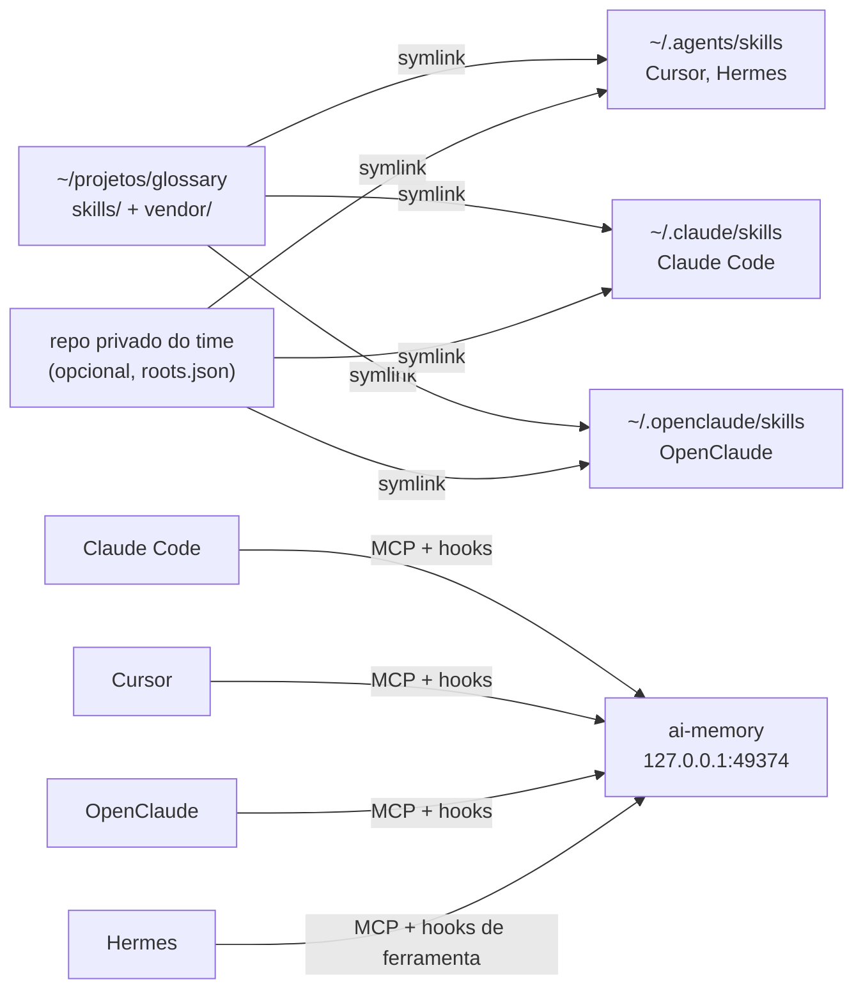

# Referência avançada

O jeito normal de instalar e atualizar é o `./install.sh` (ver [PASSO-A-PASSO.md](PASSO-A-PASSO.md)). Esta página explica o que ele faz por baixo, como rodar cada parte separada e os casos que o instalador não cobre.

## Como funciona

São três partes independentes. Dá para instalar só uma delas.

- **Skills**: instruções reutilizáveis (`SKILL.md`) numa pasta só. Cada agente enxerga as mesmas skills por symlink. Atualizar é `git pull`.
- **Memória (ai-memory)**: um servidor local captura as sessões de todos os agentes. Você começa uma tarefa no Claude Code e continua no Cursor sem explicar tudo de novo.
- **Navegação de código (Serena)**: o agente busca e edita símbolos (métodos, referências) via language server, em vez de ler arquivos inteiros.



| Agente | Skills | Memória | Serena |
|---|---|---|---|
| Claude Code | `~/.claude/skills` | MCP + hooks (captura automática) | MCP, contexto `claude-code` |
| Cursor | `~/.agents/skills` e também `~/.claude/skills` | MCP + hooks (captura automática) | MCP, contexto `ide` |
| Hermes | `~/.agents/skills`, via `skills.external_dirs` | MCP + hooks de ferramenta | MCP, contexto `ide` |
| OpenClaude | `~/.openclaude/skills` | MCP + hooks (captura automática), só se for confiável | MCP, contexto `claude-code` |

- **OpenClaude**: deriva do Claude Code e lê os mesmos hooks na pasta de config dele. O instalador grava os hooks do Claude Code em `~/.openclaude/settings.json` (com `CLAUDE_CONFIG_DIR=~/.openclaude`). As sessões dele aparecem na memória como `claude-code`. Os hooks também entregam ao OpenClaude o resumo da sessão anterior, por isso só entram se você responder que ele é confiável.
- **Hermes**: o ai-memory grava as ferramentas que o Hermes usa (`pre_tool_call` e `post_tool_call`), num bloco `hooks:` que o instalador acrescenta ao `~/.hermes/config.yaml`. Na primeira sessão, o Hermes pede para aprovar cada hook; responda sim. As mensagens e o fim da sessão do Hermes ficariam com um plugin de memória da comunidade (`ai-memory-hermes-plugin`), que o glossary não instala. Para o handoff, o Hermes usa as ferramentas `memory_*` do MCP.

## Rodar as partes separadas

O `./install.sh` faz as perguntas e chama o `glossary.mjs`. Ele também pode ser usado direto:

```bash
node glossary.mjs --dry-run                     # mostra tudo o que faria, sem mudar nada
node glossary.mjs --only skills                 # só uma parte: skills, ai-memory ou serena
node glossary.mjs --agents claude,cursor        # só alguns agentes (padrão: os que estiverem instalados)
node glossary.mjs --check                       # confere tudo, sem mudar nada
```

Sem `--yes`, ele pede confirmação antes de gravar em cada config de agente. Cada parte também tem seu script: `scripts/link.mjs`, `ai-memory/setup.mjs` e `serena/setup.mjs`, todos com `--dry-run`.

## Skills

```bash
node glossary.mjs --only skills --dry-run
node glossary.mjs --only skills
```

O dry-run mostra cada symlink que seria criado, sem mudar nada. A execução real faz o seguinte:

1. **Valida** todas as skills (`scripts/validate.mjs`).
2. **Cria um symlink por skill** em `~/.agents/skills`, `~/.claude/skills` e `~/.openclaude/skills`, conforme os agentes. Nunca mexe em pasta que já existe nem em symlink que aponte para fora do glossary. Remove só symlinks órfãos que ele mesmo criou.
3. **No Hermes**, pergunta antes de gravar `~/.agents/skills` em `skills.external_dirs`.
4. **Ativa a trava de pre-commit** neste repositório (`git config core.hooksPath .githooks`).

Para conferir:

```bash
ls -la ~/.claude/skills ~/.agents/skills ~/.openclaude/skills
```

O `code-review` do mattpocock fica fora do `~/.claude/skills` de propósito, para não esconder o `/code-review` embutido do Claude Code.

## Memória compartilhada (ai-memory)

```bash
node glossary.mjs --only ai-memory --dry-run
node glossary.mjs --only ai-memory
```

O script faz, em ordem:

1. **Binário**: baixa a versão fixada em `sources.json`, confere o sha256 contra o `sources.lock.json` e extrai em `~/Applications/ai-memory/` (Linux: `~/.local/opt/ai-memory/`). A pasta `hooks/` fica ao lado do binário.
2. **Dados**: `ai-memory init` cria `~/Library/Application Support/ai-memory` (Linux: `~/.local/share/ai-memory`). Os dados nunca vão para repositório nenhum. Para backup: `~/Applications/ai-memory/ai-memory backup --to <arquivo>`.
3. **LLM**: pergunta o provedor (veja abaixo).
4. **Serviço**: grava o LaunchAgent `~/Library/LaunchAgents/com.github.akitaonrails.ai-memory.plist` com `chmod 600` e sobe com `launchctl bootstrap`. No Linux, grava `~/.config/systemd/user/ai-memory.service` e o arquivo de ambiente `~/.config/ai-memory/env` (`chmod 600`). O servidor escuta só em `127.0.0.1:49374`, sem token.
5. **Agentes**: pergunta, agente por agente, antes de gravar.
   - Claude Code e Cursor: `install-mcp` e `install-hooks` do próprio ai-memory.
   - Hermes: `hermes mcp add ai-memory --url http://127.0.0.1:49374/mcp`, sem autenticação e com todas as ferramentas.
   - OpenClaude: `openclaude mcp add --scope user --transport http ai-memory http://127.0.0.1:49374/mcp`.
6. **Skills do próprio ai-memory**: instala as `ai-memory-*`. São pastas reais, e o glossary convive com elas.

### Qual LLM escolher

O LLM serve para destilar as sessões em páginas de regras, conceitos e armadilhas. Sem ele, captura, busca e handoff funcionam normalmente.

| Opção | Como | Observação |
|---|---|---|
| `none` (padrão) | `--llm none` | Sem custo. Captura, busca e handoff funcionam. |
| `anthropic` | `--llm anthropic` e a chave de API do Claude Console | Caminho suportado, com cobrança por uso. Modelo padrão: `claude-haiku-4-5`. |
| `anthropic-oauth` | `--llm anthropic-oauth`; o script roda `claude setup-token` e pede o token | **Leia o aviso abaixo.** |

> **Aviso sobre `anthropic-oauth`.** Essa opção usa o token da assinatura Claude (Pro/Max) fora do Claude Code. A documentação do ai-memory diz que isso é "não oficial e contra as políticas de uso da Anthropic" e que a conta pode sofrer limite ou bloqueio. A [página de termos do Claude Code](https://code.claude.com/docs/en/legal-and-compliance) diz que o OAuth da assinatura serve ao uso comum do Claude Code e dos apps nativos da Anthropic. Além disso, o uso divide o mesmo limite da assinatura. Prefira `none` ou `anthropic`.

A chave ou o token é digitado sem eco e testado com `ai-memory llm-test` antes de ser gravado. Ele fica só no plist (macOS) ou em `~/.config/ai-memory/env` (Linux), os dois com `chmod 600`.

### Conferir à mão

```bash
launchctl print gui/$(id -u)/com.github.akitaonrails.ai-memory | grep state   # Linux: systemctl --user status ai-memory
curl -s -o /dev/null -w '%{http_code}\n' http://127.0.0.1:49374/mcp           # 405 = servidor no ar
~/Applications/ai-memory/ai-memory status
~/Applications/ai-memory/ai-memory llm-test --provider anthropic --model claude-haiku-4-5 --prompt ok   # só se configurou LLM
```

O painel web fica em `http://127.0.0.1:49374/web`.

**Teste de handoff**: comece uma tarefa no Claude Code numa pasta, encerre a sessão, abra o Cursor na mesma pasta e veja o resumo da sessão anterior entrar no começo da conversa.

## Serena

```bash
node glossary.mjs --only serena --dry-run
node glossary.mjs --only serena
```

O script:

1. Instala ou ajusta o Serena na versão fixada (`uv tool install --force serena-agent==<versão>`), pedindo confirmação.
2. Ajusta `~/.serena/serena_config.yml`, com backup antes:
   - `project_serena_folder_location` vai para `~/.serena/projects/<pasta>/.serena`. O padrão do Serena cria `.serena/` **dentro de cada repositório**; centralizar mantém o `git status` limpo. Projetos de pastas com o mesmo nome compartilham a mesma pasta central.
   - `web_dashboard_open_on_launch: false`. O painel continua em `http://127.0.0.1:24282/dashboard/`, mas não abre uma aba a cada sessão.
   - `base_modes` ganha `no-memories` se você aceitar. A memória fica com o ai-memory. Para escolher sem pergunta: `--memories off` ou `--memories keep`.
   - `trusted_project_path_patterns` recebe a pasta onde o glossary foi clonado, por exemplo `~/projetos/**` (outro lugar: `--trusted "<glob>"`).
3. Registra o MCP em cada agente, com o caminho absoluto do binário. Apps de interface gráfica no macOS não herdam o `PATH` do terminal. Se o agente já tiver um `serena` sem `--project-from-cwd` ou com outro contexto, o script mostra o registro atual e pergunta antes de trocar.

**Linguagens**: Python, TypeScript/JavaScript, Java, Go, Rust, C#, PHP, Ruby, Kotlin e muitas outras ([lista](https://oraios.github.io/serena/01-about/020_programming-languages.html)). **Não existe language server de Apex**: num projeto Salesforce, o Serena só ajuda com o JavaScript dos LWC. Para esses projetos, fixe `typescript` (ver "Projetos da empresa"); o instalador faz isso sozinho quando acha um `sfdx-project.json`.

**Custo**: as descrições das ferramentas do Serena entram no contexto de toda sessão. Compare o uso de tokens de uma tarefa típica com e sem o Serena (`/context` no Claude Code e o painel do Serena) antes de decidir manter ligado.

## O que muda em cada agente

| Agente | O que o glossary altera | Como conferir |
|---|---|---|
| Claude Code | symlinks em `~/.claude/skills`; `~/.claude.json` (MCP `ai-memory` e `serena`); `~/.claude/settings.json` (hooks) | `claude mcp list` ou `/mcp` dentro da sessão; chame uma skill pelo nome, ex.: `/ponytail-review` |
| Cursor | symlinks em `~/.agents/skills`; `~/.cursor/mcp.json` (`ai-memory` e `serena`, sem apagar os outros servidores); `~/.cursor/hooks.json` | Settings → MCP mostra os dois conectados |
| Hermes | `~/.hermes/config.yaml` (`skills.external_dirs`, `mcp_servers` e `hooks`) | `hermes mcp test ai-memory`, `hermes mcp test serena`, `hermes hooks doctor`, `hermes skills list` |
| OpenClaude | symlinks em `~/.openclaude/skills`; `~/.openclaude.json` (MCP); `~/.openclaude/settings.json` (hooks) | `openclaude mcp list`, `openclaude skills list` |

Antes de cada escrita, o arquivo original é copiado para `<arquivo>.glossary-bak-AAAAMMDD-HHMMSS`, na mesma pasta. O `install-mcp`/`install-hooks` do ai-memory também guarda um backup próprio com data.

## Projetos da empresa

Projetos com dado sensível ganham tratamento à parte, descrito num arquivo **local** (nunca no repositório): `~/.config/glossary/projects.json`.

```json
{
  "projects": [
    {
      "dir": "~/projetos/meu-projeto-salesforce",
      "aiMemory": { "workspace": "empresa", "ignore_paths": ["config/**", "data/**"] },
      "serena": { "language_servers": ["typescript"] }
    }
  ]
}
```

- **`aiMemory`**: o setup grava `.ai-memory.toml` na raiz do projeto, com um workspace próprio (isolado dos projetos pessoais) e `[capture] ignore_paths`. Leitura e edição de arquivo nesses caminhos são descartadas antes de sair da máquina. O arquivo entra em `.git/info/exclude`, então **não gera diff** no repositório da empresa. O script pergunta antes de mexer no projeto.
- **`serena`**: fixa as linguagens do projeto, sem detecção automática.
- **Nunca** use roteador de terceiros (OrcaRouter, OpenRouter) nem o free tier do Gemini em sessões com dados de produção.

**Ordem certa**: crie o `projects.json` e rode `node glossary.mjs --only ai-memory,serena` **antes** de abrir um agente no projeto. Sem o `.ai-memory.toml`, a captura vai para o workspace `default`.

**Se o projeto já caiu no `default`** (aparece como `default` em http://127.0.0.1:49374/web), mova-o enquanto o workspace de destino ainda não tiver um projeto com o mesmo nome. Nesse caso a mudança é completa e não perde nada. Se o destino já tiver o projeto, o ai-memory mescla e mantém só as páginas duráveis.

```bash
cd ~/projetos/meu-projeto-salesforce
~/Applications/ai-memory/ai-memory move-project --from-workspace default --to-workspace empresa --confirm --force
```

O `--force` só é exigido quando há uma sessão aberta no projeto. Ele é seguro: a mudança atualiza o apontamento da sessão.

**Importar o histórico antigo**: o `./install.sh` oferece, uma vez por computador, levar para a memória tudo o que o Claude Code já guardou: as conversas de cada pasta (`~/.claude/projects/*/*.jsonl`) e as memórias dele (`memory/*.md`, que viram páginas duráveis em `notes/claude-memory/`, com a tag `claude-memory`). Cada pasta vai para o workspace do seu `.ai-memory.toml`, então configure os projetos da empresa antes. Para rodar de novo: `node ai-memory/history.mjs` mostra o que encontrou e `--apply` importa; conversas só entram num projeto que ainda não tem nenhuma, e cada memória atualiza a mesma página.

Para um projeto só, rode dentro dele, depois do workspace criado:

```bash
~/Applications/ai-memory/ai-memory backfill --max-sessions 50 --dry-run   # mostra quantas sessões e para onde
~/Applications/ai-memory/ai-memory backfill --max-sessions 50
```

Sem `--force`, o backfill só importa quando o projeto ainda não tem nenhuma sessão na memória. **Evite o `--force`**: o ai-memory não reconhece conversas repetidas, então cada importação forçada duplica todo o histórico, inclusive as sessões que os hooks já tinham capturado. Se o projeto caiu no `default` e você o moveu (acima), o `--force` é o único jeito de trazer as conversas antigas: rode-o uma vez e depois `node ai-memory/dedupe.mjs --apply`.

**Histórico duplicado**: `node ai-memory/dedupe.mjs` lista, para cada projeto da empresa, as sessões que estão na memória e têm a conversa original no disco, sem alterar nada. Com `--apply`, ele faz um backup completo (`~/ai-memory-backup-<data>.tar.gz`), apaga essas sessões e importa cada uma de novo, uma vez só. Sessões sem a conversa no disco ficam como estão. Feche as sessões do Claude Code e do Cursor nessas pastas antes. Uma sessão refeita perde só o que não estava na conversa original, como as tarefas de handoff que ela criou.

Atenção: o backfill **não** aplica o `ignore_paths`. O que uma conversa antiga leu entra como está, mas fica só na sua máquina.

**Memórias do Claude Code** (`~/.claude/projects/<projeto>/memory/*.md`) não são importadas pelo backfill. Para que os outros agentes também as usem, transforme-as em skills do repositório privado com `scripts/port-memories.mjs` (ver "Contribuir e manter").

**`.serena` dentro do projeto**: se o Serena rodou no projeto antes do setup, existe uma pasta `.serena` no repositório, e ela tem prioridade sobre a pasta central. Confira que não está commitada (`git ls-files .serena` não imprime nada) e mova:

```bash
mkdir -p ~/.serena/projects/meu-projeto-salesforce
mv ~/projetos/meu-projeto-salesforce/.serena ~/.serena/projects/meu-projeto-salesforce/.serena
```

## Contribuir e manter

**Atualizar**: `git pull` no `~/projetos/glossary`. Mudanças no conteúdo das skills aparecem na hora, porque os agentes leem pelo symlink. Skill nova ou removida: `node scripts/link.mjs`.

**Criar uma skill**:

```bash
cp -r templates/skill skills/minha-skill
# ajuste name (igual ao nome da pasta) e description; escreva o corpo
node scripts/validate.mjs
node scripts/link.mjs
```

Depois abra um PR. Regras das skills próprias: `name` em `a-z0-9-` igual ao nome da pasta (até 64 caracteres), `description` com até 1024 caracteres, `SKILL.md` com até 500 linhas. No frontmatter valem só os campos do padrão [agentskills.io](https://agentskills.io) mais `disable-model-invocation` e `argument-hint`.

**Portar comandos do Cursor**: `node scripts/port-cursor-commands.mjs --dry-run` e depois sem `--dry-run`. O corpo é copiado sem alteração, com o mesmo nome. Se o guard bloquear, o comando tem dado da empresa: porte com `--to <repo privado>/skills`. O guard só conhece os termos do `guard-deny.txt`, então crie esse arquivo **antes** de portar e leia os comandos que ficaram no público. Depois de portar, mova `~/.cursor/commands` para um backup, senão o Cursor mostra cada comando duas vezes.

**Portar memórias do Claude Code**: monte um mapa (fica no repositório privado) agrupando as memórias em skills e rode `node scripts/port-memories.mjs --map <mapa.json> --to <repo privado>/skills`. O formato do mapa está no topo do script. Evite colar JSON grande no terminal, porque ele pode cortar o texto; prefira criar o arquivo num editor.

**Trava contra vazamento**: o pre-commit roda `scripts/guard.mjs` e bloqueia e-mail, domínio `.com.br`, CPF, tokens (`sk-`, `ghp_`, `github_pat_`, `xoxb-`/`xoxp-`, `AKIA`), caminho absoluto de home e os termos da empresa. Os termos ficam em `~/.config/glossary/guard-deny.txt`, um por linha, e nunca no repositório. A mensagem mostra arquivo:linha e o tipo, nunca o valor. Ocorrência legítima vai para `.guard-allow` (exceto termo da empresa, que não tem exceção).

**PR semanal de sync**: toda segunda a Action `sync` baixa as fontes, atualiza `vendor/`, o lock e as versões do ai-memory e do Serena, roda o validate e o guard, e abre (ou atualiza) um PR. **O merge é sempre manual**: leia o diff das skills, porque elas entram no contexto de todos os agentes. Para a Action funcionar, o repositório precisa de:

- o secret `GUARD_DENY` (Settings → Secrets and variables → Actions), com os mesmos termos do `guard-deny.txt`, um por linha;
- "Allow GitHub Actions to create and approve pull requests" ligado (Settings → Actions → General).

**Trava antes do merge**: no GitHub, o `main` fica protegido por uma regra (Settings → Rules → Rulesets → New branch ruleset):

- **Target branches**: Include default branch.
- **Restrict deletions** e **Block force pushes**.
- **Require a pull request before merging**, com 0 aprovações obrigatórias (o GitHub não deixa você aprovar o próprio PR).
- **Require status checks to pass**, com o check `validate`.
- **Bypass list** vazia, para a regra valer também para quem administra o repositório.

Com isso, ninguém faz push direto no `main`: toda mudança vai num branch, vira PR e só pode ser mergeada com o `validate` (regras das skills e trava contra vazamento) verde. O PR semanal do sync dispara a validação sozinho.

```bash
git switch -c minha-mudanca
git add skills && git commit -m "Descreve a mudança"
git push -u origin minha-mudanca     # depois abra o PR no GitHub
```

**Repositório privado**: o `./install.sh` cria o `glossary-internal` ao lado do glossary (só local, `git init` sem remote) e registra a pasta `skills/` dele em `~/.config/glossary/roots.json`. As skills de lá entram no link e no validate como as do glossary. Para outra pasta, ou mais de uma, edite o `roots.json`:

```json
[{ "dir": "~/projetos/skills-do-time/skills", "agents": ["claude", "cursor", "hermes"] }]
```

Skills com regra ou acesso da empresa não devem chegar a um agente que use modelo de terceiros. A skill só entra numa pasta se **todos** os agentes que leem aquela pasta estiverem em `agents`. O instalador ajusta essa lista a cada rodada pela resposta sobre o OpenClaude: com "não", nada das raízes privadas vai para `~/.openclaude/skills`.

**Outro computador**: `./install.sh --export` gera `~/glossary-privado.tar.gz` (chmod 600) com os repositórios privados inteiros (com o histórico do git), o `guard-deny.txt` e o `projects.json`. O `install.json` fica de fora, porque os agentes podem ser outros. No outro computador, `./install.sh --import <arquivo>`:

- põe cada repositório ao lado do glossary; um `glossary-internal` vazio criado pelo instalador é substituído, e qualquer outro que já exista é renomeado para `<pasta>.antes-<data>`;
- junta os termos da trava aos que já existirem;
- refaz o caminho dos projetos da empresa a partir da pasta do glossary e adiciona só os que já existem nesta máquina.

O pacote tem dados da empresa: leve por pendrive ou `scp` e apague depois.

## Desfazer

```bash
node scripts/link.mjs --unlink              # tira os symlinks das skills
node ai-memory/setup.mjs --uninstall        # tira MCP, hooks e skills do ai-memory dos agentes e para o serviço
node serena/setup.mjs --uninstall           # tira o MCP do Serena dos agentes
```

Os três aceitam `--dry-run`. Os dados do ai-memory e a config do Serena ficam onde estão. Para ir além:

- Parar o serviço à mão: `launchctl bootout gui/$(id -u)/com.github.akitaonrails.ai-memory` (Linux: `systemctl --user disable --now ai-memory`).
- Apagar o plist, que pode conter o token: `rm ~/Library/LaunchAgents/com.github.akitaonrails.ai-memory.plist`.
- Remover o Serena: `uv tool uninstall serena-agent`.
- Restaurar uma config: copie de volta o `<arquivo>.glossary-bak-<data>` mais recente.
- Restaurar um backup da memória (por exemplo, o do `dedupe.mjs`): pare o serviço, restaure e suba de novo.

  ```bash
  launchctl bootout gui/$(id -u)/com.github.akitaonrails.ai-memory   # Linux: systemctl --user stop ai-memory
  ~/Applications/ai-memory/ai-memory restore --from ~/ai-memory-backup-<data>.tar.gz --force
  ./install.sh --yes
  ```

## Problemas comuns

- **Skill duplicada no Cursor**: o Cursor lê `~/.agents/skills` e também `~/.claude/skills`. Se a lista mostrar tudo em dobro, rode `node glossary.mjs --only skills --no-claude-dir`. Isso tira os links de `~/.claude/skills`, e o Claude Code deixa de ver as skills do glossary.
- **`/code-review` do Claude escondido**: o `code-review` do mattpocock é excluído do `~/.claude/skills` em `link.json`. Se apareceu, veja `ls -la ~/.claude/skills/code-review` e rode `node scripts/link.mjs`.
- **Hermes editando skill**: o Hermes pode alterar skills em `external_dirs`. A mudança aparece no `git status` do glossary. Em `vendor/`, o `validate.mjs` acusa a diferença; desfaça com `git checkout -- vendor`.
- **Hermes diz "streamable_http is not available"**: falta o suporte a MCP via HTTP. Reinstale o Hermes com o extra `mcp` (por exemplo, `uv tool install --force 'hermes-agent[mcp]'`) e rode `hermes mcp test ai-memory`.
- **Porta 49374 ocupada**: `lsof -iTCP:49374 -sTCP:LISTEN` mostra quem está usando. Em geral é um `ai-memory serve` esquecido num terminal.
- **`setup-token` falha**: ele exige assinatura Claude Pro ou Max. Sem ela, use `--llm none` ou `--llm anthropic`.
- **Commit bloqueado pelo guard**: leia o arquivo:linha apontado e remova o dado. Se for legítimo e não for termo da empresa, registre em `.guard-allow`.
